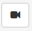
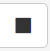
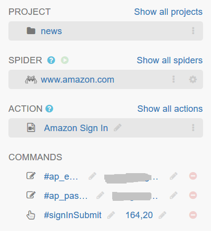
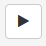
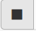

.. _actions:

=======
Actions
=======

What are actions?
=================

Sometimes, you will need input user name and password to login, or give a query string to begain a search. Portia can't do this by default. So we add a functionality called "Action" to Portia, like Selenium IDE, user interaction with current page such as mouse click, keyboard input can be recorded as Action, and will be playback when crawling is started.  

.. _what-are-annotations:

What are commands?
=====================

Action has a sequences of commands, which hold event that user triggers, such as mouse click or keyboard input, and so on. Each command has three properties: Event, Target and Value. Event is name of event issued by user,  there are only two type of event ('click' and 'input') are supported now. Target is selector to the element which Event is about, and Value is the parameters of Event, for example, Value of 'click' is the coordinates of the click,  and value of 'input' is the string content of user input. 

Commands
===========

Recording commands
--------------------

When Action was created, you can begin to record commands by click |icon-record| button, any event user triggered will be saved and displayed at commands area of Action in left siderbar.  When all event was recorded, you can stop recoding by click |icon-stop-record| button. 

Commands can be record accumulatively, this means when you click |icon-record| button again, the new commands record will be append to old ones.

Edit commands
-------------------

Commands can be further edited when Action is not in recording or playing state. Such editions includes: delete unnecessary Commands, modify Selector of Target , change Value of Command, and adjust sequences of Commands by drag-and-drop.  

Playback commands
-------------------

To see if Commands are correctly configured, you  can click |icon-play| button to play back commands.  When |icon-play| button clicked, Event according to Command will be replay one by one, result will be displayed at browser window meanwhile. 

When there are results out of expection, you can stop playback by click |icon-stop-play| button at any times. 

.. note:: In order to playback Action at crawling time, you must enable Javascript in the Spider which hold the Action.  
