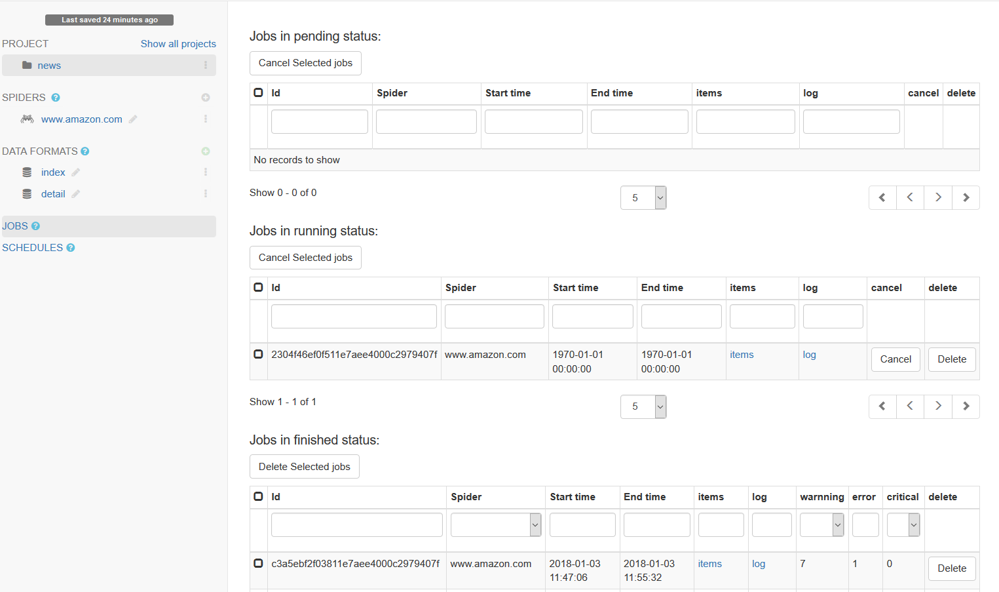
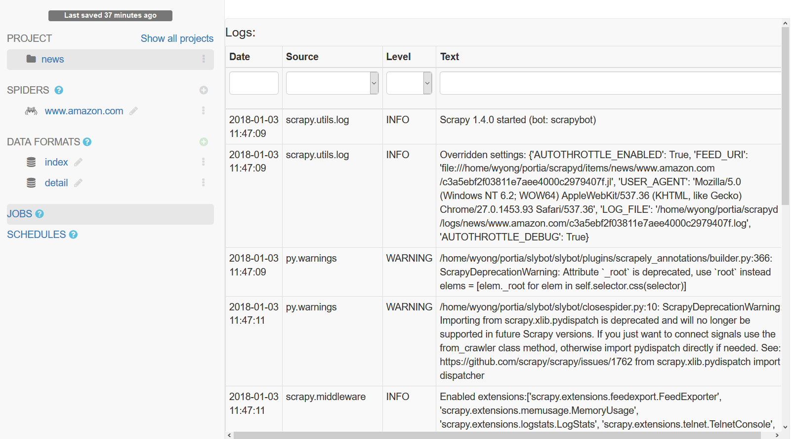
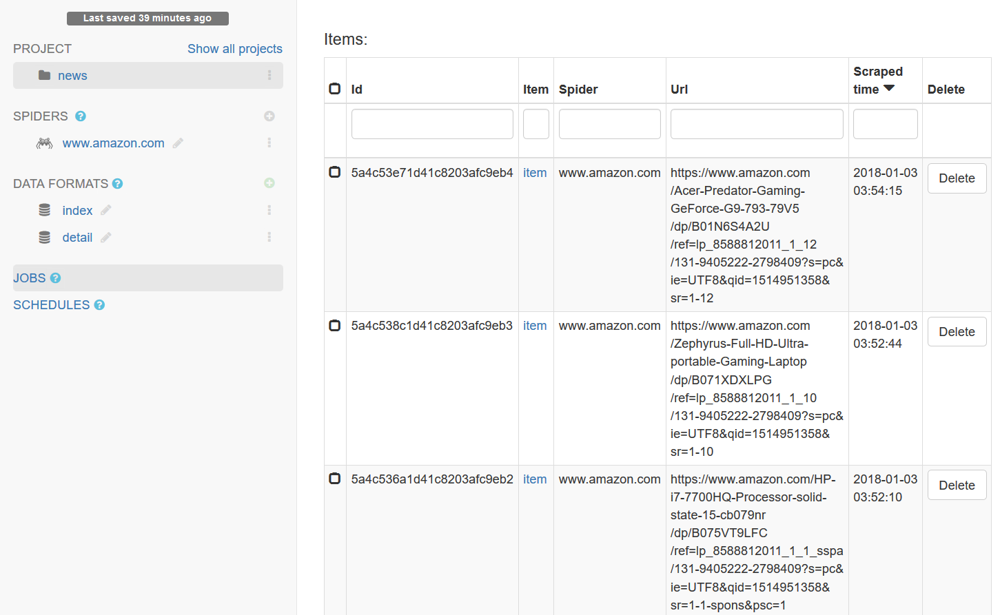

.. _jobs:

=========
Jobs
=========

You can see spider 's job status  at ``JOBS`` tab under ``Project``. 

Jobs may be in one of three status:

========= ===========
status    description
========= ===========
pending   job is waiting to start. 
running   job is currently running.
finished  job is completed. 
========= ===========

Clicking on the ``log`` of a job will take you to the log page, where you can see log information about the job :

Clicking on ``items`` of a job,  you can browse items scraped by the job. 

