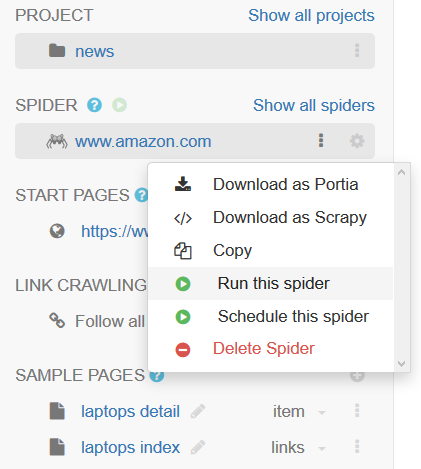
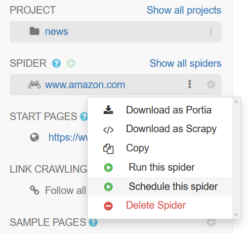
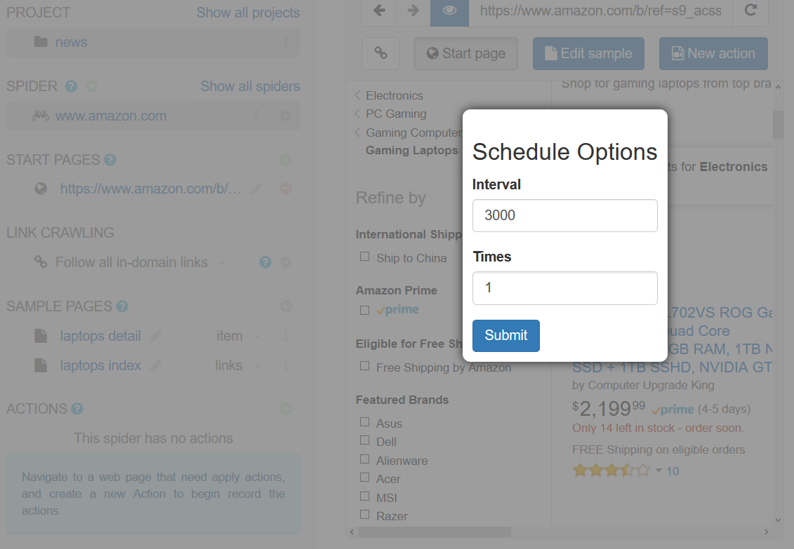

.. _spiders:

=======
Spiders
=======

Spiders are web crawlers that use :ref:`samples <samples>` to extract data from the pages it visits.

.. _spider-properties:

Spider properties
=================

You can access your spider's properties by clicking the gear icon located right of your spider in the list on the left.

.. image:: _static/portia-spider-properties.png
    :alt: Spider properties

Configuring login details
-------------------------

If you need to log into a site, you can configure login details by ticking 'Perform login' in the :ref:`spider properties <spider-properties>` menu. Here you can set the login URL, username and password.

Enabling JavaScript
-------------------

You can enable JavaScript in your spider by ticking ``Enable JavaScript`` in the :ref:`spider properties <spider-properties>` menu. Note that you'll need to set the ``SPLASH_URL`` Scrapy setting to your [Splash](https://github.com/scrapinghub/splash) endpoint URL for JavaScript to work during the crawl.

Start pages and link crawling
=============================

Start pages are the initial URLs that Portia will visit to start the crawl. You can add and remove start pages on the left menu.

You can choose how Portia will follow links under ``LINK CRAWLING``.

.. image:: _static/portia-spider-link-crawling.png
    :alt: Link crawling properties

* Follow all in-domain links - follow all links under the same domain and subdomain.
* Don't follow links - only visit start URLs.
* Configure url patterns - use regular expressions to choose which URLs to follow.

The ``Configure url patterns`` option lets you set follow and exclude patterns as well as choose whether to respect the ``nofollow`` attribute. Click the gear icon to show the link crawling options where you can set the follow/exclude patterns.

.. _running-spider:

Running a spider
================

You can run a spider by select dropdown menu item ``Run this spider`` under Spider.

.. _schedule-spider:

Schedule a spider
================

In order to run spider once in a while, you can select ``Schedule this spider`` to put spider into schedule queues, wich will be run at fixed intervals. 

At schedule options dialog, you can set intervals and run times.  

Minimum items threshold
=======================

To avoid infinite crawling loops, Portia spiders check to see if the number of scraped items meet a minimum threshold over a given period of time. If not, the job is closed with ``slybot_fewitems_scraped`` outcome.

By default, the period of time is 3600 seconds and the threshold is 200 items scraped. This means if less than 200 items were scraped in the last 3600 seconds, the job will close.

You can set the period in seconds with the ``SLYCLOSE_SPIDER_CHECK_PERIOD`` setting, and the threshold number of items with the ``SLYCLOSE_SPIDER_PERIOD_ITEMS`` setting.

